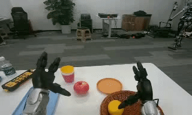
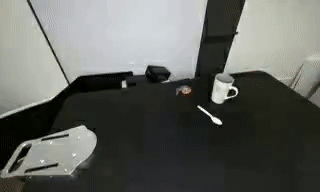
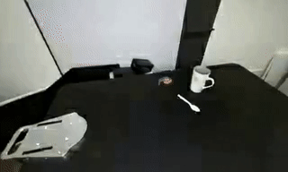

# Beyond Viewpoint Generalization:What Multi-View Demonstrations Offer and How to Synthesize Them for Robot Manipulation (RoboNVS)

<p align="center">
  
</p>

<p align="center">
  <a href="https://arxiv.org/abs/2506.05554">📄 Paper</a> |
  <a href="https://youngyng.github.io/RoboNVS.github.io/">🤖 Homepage</a> |
  <a href="https://github.com/YoungYNG/RoboNVS_code">💻 Code</a>
</p>


<p align="center">
  <strong>
  Boyang Cai<sup>1,2,*,†</sup> &nbsp;
  <a href="https://kolakivy.github.io">Qiwei Liang</a><sup>1,2,*</sup> &nbsp;
  <a href="https://exaggerate-maker.github.io/">Jiawei Li</a><sup>2,*</sup> &nbsp;
  <a href="https://wsh11111-d.github.io">Shihang Weng</a><sup>2,*</sup> &nbsp;
  Zhaoxin Zhang<sup>2,*</sup><br>

  <a href="https://www.lintao.online">Tao Lin</a><sup>3</sup> &nbsp;
  <a href="https://changerc77.github.io">Xiangyu Chen</a><sup>1</sup> &nbsp;
  Wenjie Zhang<sup>1</sup> &nbsp;
  Jiaqi Mao<sup>4</sup> &nbsp;
  <a href="https://wesleyxu224.github.io">Weisheng Xu</a><sup>1</sup> &nbsp;
  Bin Yang<sup>1</sup> &nbsp;
  Jiaming Liang<sup>1,2</sup> &nbsp;
  <a href="https://junhaocai27.github.io">Junhao Cai</a><sup>2</sup> &nbsp;
  Renjing Xu<sup>1,‡</sup>
  </strong>
</p>
<p align="center">
  <sup>1</sup> The Hong Kong University of Science and Technology (Guangzhou) &nbsp;&nbsp;&nbsp;
  <sup>2</sup> Shenzhen University &nbsp;&nbsp;&nbsp;
  <sup>3</sup> Beijing Jiaotong University &nbsp;&nbsp;&nbsp;
  <sup>4</sup> The Chinese University of Hong Kong, Shenzhen
</p>

<p align="center">
  * Equal Contribution &nbsp;&nbsp; † Project Leader &nbsp;&nbsp; ‡ Corresponding Author
</p>


<!-- <p align="center">
  <a href="https://arxiv.org/abs/2506.05554">📄 Paper</a> |
  <a href="https://youngyng.github.io/RoboNVS.github.io/">🤖 Homepage</a> |
  <a href="https://github.com/YoungYNG/RoboNVS_code">💻 Code</a>
</p> -->


## 📰 News
**22-3-2026: Our project page, code and models are all released.**


## ✨ Key Points
- 🎯 **Goal**: Train a generative model tailored for robotic manipulation that produces viewpoint-consistent outputs under controlled camera transformations.
- ⚠️ **Limitation of Prior Work**: Existing models suffer from uncontrolled camera trajectories and lack sufficient manipulation-centric training data.
- 🧠 **Our Approach**: We leverage large-scale robot datasets (e.g., DROID, RoboCOIN) and construct self-supervised training pairs under static camera assumptions.


## 🎬 Demo Results

<div align="center">


</div>


  

## 🏗️ Framework Overview

  

<div align="center">


</div>

  
Our framework consists of two key components:
- 🧩 **Depth Alignment**: We align temporally consistent relative depth from DepthCrafter with metric depth from DA3 via a global scale–shift transformation, enabling geometry-consistent view synthesis with accurate camera-aware structure.
- 🔄 **Bi-directional Masking**: We introduce complementary masking to expose the model to diverse occlusion patterns, improving robustness to viewpoint-induced appearance changes.


## 🚀 Quick Start
### Installation
```bash
git clone https://github.com/YoungYNG/RoboNVS_code.git
cd RoboNVS_code

## conda setup
conda create -n robonvs python=3.10
conda activate robonvs
# Install PyTorch (2.x recommended)
pip install torch==2.4.1 torchvision==0.19.1 torchaudio==2.4.1 --index-url https://download.pytorch.org/whl/cu124
# Install Nvdiffrast
pip install git+https://github.com/NVlabs/nvdiffrast.git
# Install dependencies
pip install -e .
pip install --no-build-isolation git+https://github.com/nerfstudio-project/gsplat.git@0b4dddf04cb687367602c01196913cde6a743d70 # for gaussian head
```
### Download Pretrained Model

```bash
huggingface-cli download Wan-AI/Wan2.1-I2V-14B-480P --local-dir ./models/Wan-AI
huggingface-cli download youngszu/RoboNVS_14B --local-dir ./models/RoboNVS
huggingface-cli download depth-anything/DA3NESTED-GIANT-LARGE-1.1 ./Depth-Anything-3/models/da3_gaint_nest_1.1
```


### Example Usage
#### 1. DW-Mesh Reconstruction with our improved depth estimation
```bash
## optional according to your local device
CUDA_VISIBLE_DEVICES=0 \
CUDA_HOME=/usr/local/cuda-11.8 \
PATH=/usr/local/cuda-11.8/bin:/usr/bin:$PATH \
LD_LIBRARY_PATH=/usr/local/cuda-11.8/lib64:$LD_LIBRARY_PATH \
TORCH_CUDA_ARCH_LIST="8.9" \
CC=/usr/bin/gcc \
CXX=/usr/bin/g++ \
CUDAHOSTCXX=/usr/bin/g++ \

## Reconstruction
python recon.py --input_video demo_inputs/demo01.mp4 --output_dir ./output \
--view_type left \
--angle 20 \
--save_mesh
```
#### 2. RoboNVS Generation (48GB VRAM required)
```bash
python generate.py \
--color_video output/color.mp4 \
--mask_video output/mask.mp4 \
--output_video output/output.mp4 \

## if your GPUs have only 24GB per GPU(e.g., 4090, 3090), you can use the following cmd to generate the videos
python generate_multi_gpu.py \
--color_video output/color.mp4 \
--mask_video output/mask.mp4 \
--output_video output/output.mp4 \
--gpu_ids 0,1,2  ## or 1,2,3,...
```

<div style="border: 2px solid #ddd; border-radius: 10px; padding: 15px; margin-bottom: 20px;">
<b>Demo 1</b>
<table>
<tr>
<td width="30%" align="center">

<br><b>Input</b>
</td>

<td align="center">➜</td>

<td width="30%" align="center">

<br><b>Reconstruction</b>
</td>

<td align="center">➜</td>

<td width="30%" align="center">

<br><b>Output</b>
</td>
</tr> 
</table>
</div>


<div style="border: 2px solid #ddd; border-radius: 10px; padding: 15px;">
<b>Demo 2</b>
<table>
<tr>
<td width="30%" align="center">

<br><b>Input</b>
</td>

<td align="center">➜</td>

<td width="30%" align="center">

<br><b>Reconstruction</b>
</td>

<td align="center">➜</td>

<td width="30%" align="center">

<br><b>Output</b>
</td>
</tr> 
</table>
</div>