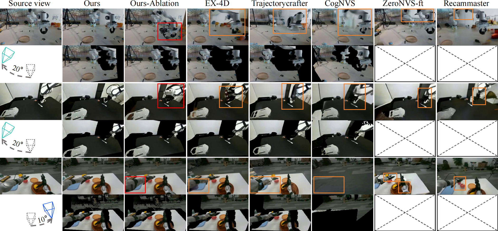
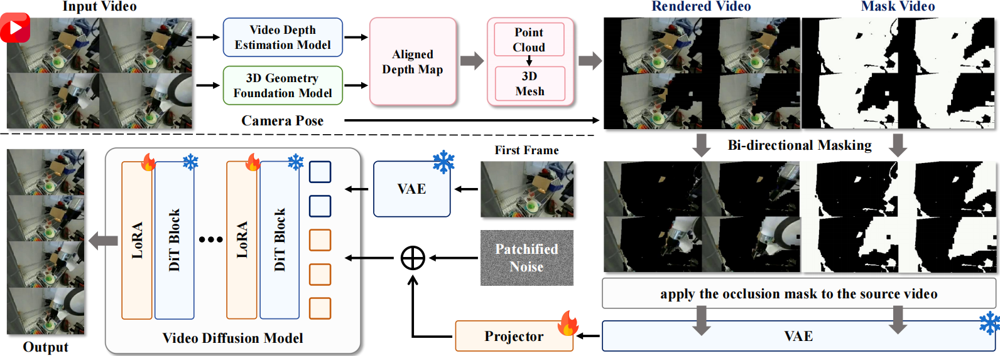

# Beyond Viewpoint Generalization:What Multi-View Demonstrations Offer and How to Synthesize Them for Robot Manipulation (RoboNVS)

______________

<div align="center">
[📄 Paper](https://arxiv.org/abs/2506.05554)  |  [🤖 Homepage](https://youngyng.github.io/RoboNVS.github.io/)  |  [💻 Code](https://github.com/YoungYNG/RoboNVS_code#)
</div>

## 🌟 Highlights
- **🎯 Extreme Viewpoint Synthesis**: Generate high-quality 4D videos with camera movements ranging from -90° to 90°
- **🔧 Depth Watertight Mesh**: Novel geometric representation that models both visible and occluded regions
- **⚡ Lightweight Architecture**: Only 1% trainable parameters (140M) of the 14B video diffusion backbone
- **🎭 No Multi-view Training**: Innovative masking strategy eliminates the need for expensive multi-view datasets
- **🏆 State-of-the-art Performance**: Outperforms existing methods, especially on extreme camera angles

## 🎬 Demo Results

  

<div align="center">



</div>

  

*EX-4D transforms monocular videos into camera-controllable 4D experiences with physically consistent results under extreme viewpoints.*

  

## 🏗️ Framework Overview

  

<div align="center">



</div>

  

Our framework consists of three key components:
1. **🔺 Depth Watertight Mesh Construction**: Creates a robust geometric prior that explicitly models both visible and occluded regions
2. **🎭 Simulated Masking Strategy**: Generates effective training data from monocular videos without multi-view datasets
3. **⚙️ Lightweight LoRA Adapter**: Efficiently integrates geometric information with pre-trained video diffusion models

## 🚀 Quick Start
### Installation
```bash
git clone https://github.com/YoungYNG/RoboNVS_code.git
cd RoboNVS_code

## conda setup
conda create -n robonvs python=3.10
conda activate robonvs
# Install PyTorch (2.x recommended)
pip install torch==2.4.1 torchvision==0.19.1 torchaudio==2.4.1 --index-url https://download.pytorch.org/whl/cu124
# Install Nvdiffrast
pip install git+https://github.com/NVlabs/nvdiffrast.git
# Install dependencies
pip install -e .
pip install --no-build-isolation git+https://github.com/nerfstudio-project/gsplat.git@0b4dddf04cb687367602c01196913cde6a743d70 # for gaussian head
```
### Download Pretrained Model

```bash
huggingface-cli download Wan-AI/Wan2.1-I2V-14B-480P --local-dir ./models/Wan-AI
huggingface-cli download youngszu/RoboNVS_14B --local-dir ./models/RoboNVS
huggingface-cli download depth-anything/DA3NESTED-GIANT-LARGE-1.1 ./Depth-Anything-3/models/da3_gaint_nest_1.1
```


### Example Usage
#### 1. DW-Mesh Reconstruction with our improved depth estimation
```bash
## optional according to your local device
CUDA_VISIBLE_DEVICES=4 \
CUDA_HOME=/usr/local/cuda-11.8 \
PATH=/usr/local/cuda-11.8/bin:/usr/bin:$PATH \
LD_LIBRARY_PATH=/usr/local/cuda-11.8/lib64:$LD_LIBRARY_PATH \
TORCH_CUDA_ARCH_LIST="8.9" \
CC=/usr/bin/gcc \
CXX=/usr/bin/g++ \
CUDAHOSTCXX=/usr/bin/g++ \

## Reconstruction
python recon.py --input_video demo_inputs/demo01.mp4 --output_dir ./output \
--view_type left \
--angle 20 \
--save_mesh
```
#### 2. RoboNVS Generation (48GB VRAM required)
```bash
python generate.py \
--color_video output/color.mp4 \
--mask_video mask.mp4 \
--output_video output/output.mp4 \

## if your GPUs have only 24GB per GPU(e.g., 4090, 3090), you can use the following cmd to generate the videos
python generate_multi_gpu.py \
--color_video output/color.mp4 \
--mask_video mask.mp4 \
--output_video output/output.mp4 \
--gpu_ids 0,1,2  ## or 1,2,3,...
```